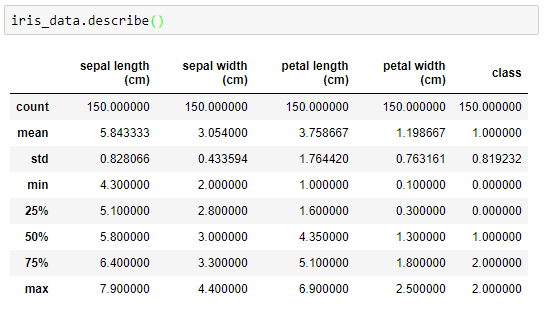
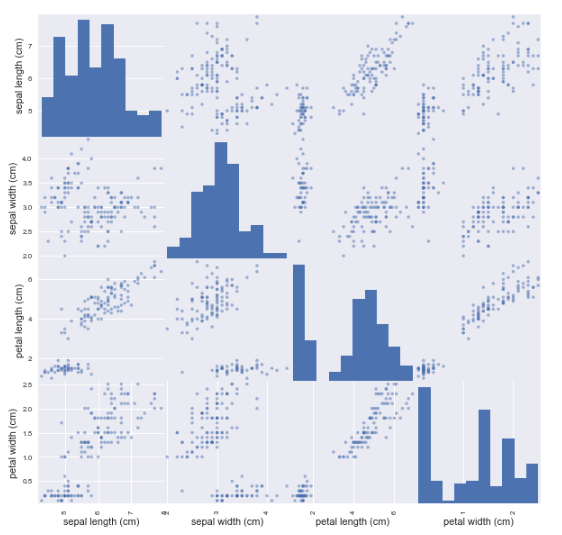
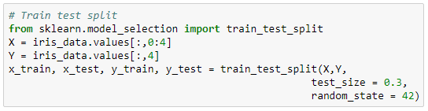
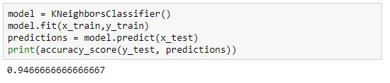
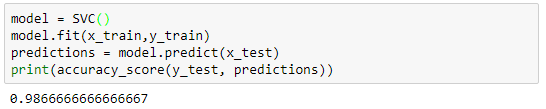
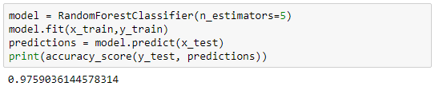
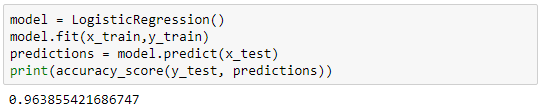
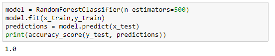

**Project-2018-Programming-and-Scripting**
==========================================

# The programming Language used to assist in writing code for this project is Python
Anaconda download is a great way to install Python and all of the common Python libraries on your computer. I recommend installing version 3.6, 64-bit. https://www.python.org/
## The following project concerns the well-known Fisher’s Iris data set
### Project Overview

The following project concerns the well-known Fisher's Iris data set. The project entails the researching of the data set, and then writing documnentation and code in the Python programmining language based on that research
I have broken down this project into several smaller tasks that are easier to solve, and plugged these together after they have been completed.I have done this by using the following guidelines:

* Research background information about the data set and write a summary about it.
* Keep a list of references that I am using in completing this project.
* I have downloaded the data set and written some Python code to investigate it.
* I have also written code that I hace been using throughout this module and tested it on the Iris data set
* Summarise the data set by, calculating the maximum, minimum and mean of each column of data set. I have imported *numpy*
to assist with these calculations.
* Wtite a summary of my investigations
* Included supporting tables and graphics of which I have used.

## Iris data set

## Because the iris data is so popular in machine learning it is frequently used in python.

## What is the famous iris data set, and how does it relate to machine learning.

First of all lets have a look at what I mean by machine learning.
Machine learning is a method of data analysis that automates analytical model building. It is a branch of artificial intelligence based on the idea that systems can learn from data, identify patterns and make decisions with minimal human intervention.

Most industries working with large amounts of data have recognized the value of machine learning technology. By gleaning insights from this data – often in real time – organizations are able to work more efficiently or gain an advantage over competitors.

Based on Fisher's linear discriminant model, this data set became a typical test case for many statistical classification techniques in machine learning such as support vector machines.

### Therefore, How do we describe a data set using machine language?
### What are the four key requirements / variables gathered?

In 1936 Edgar Anderson collected, 50 samples of three different types of iris, or 150 samples in total. For each sample, he measures the sepal length and width, and he measured the petal length and width, and recorded those measurements along with its species. 

## Edgar Anderson

* Edgar Shannon Anderson (November 9, 1897 – June 18, 1969) was an American botanist. His 1949 book Introgressive Hybridization was an original and important contribution to botanical genetics.

* Anderson was born in Forestville, New York. When he was three, his family moved to East Lansing, Michigan where his father had accepted a position to teach dairy husbandry. In 1914 Anderson entered Michigan State College to study botany and horticulture. After completing his degree he joined the Naval Reserve and in 1919 he accepted a graduate position at the Bussey Institution of Harvard University. His studies were supervised by geneticist Edward Murray East and Anderson worked on the genetics of self-incompatibility in Nicotiana. He was awarded a master's degree in 1920 and a DSc in agricultural genetics in 1922.

* He accepted a position as a geneticist at the Missouri Botanical Garden and was appointed assistant professor of botany at Washington University in St. Louis. His research was focused on developing techniques to quantify geographic variation in Iris versicolor. In 1929 he received a fellowship to undertake studies at the John Innes Horticultural Institute in Britain, where he worked with cytogeneticist C. D. Darlington, statistician R. A. Fisher, and geneticist J. B. S. Haldane. Anderson's data set on three related species of irises was used by Fisher as an example with which to demonstrate statistical methods of classification and has subsequently become very well known in the machine learning community, though often described as Fisher's iris data.

The dataset contains a set of 150 records under 5 attributes - Petal Length , Petal Width , Sepal Length , Sepal width and Class.
Iris versicolor, Iris virginica

In 1936 using this data collected, Ronald Fisher wrote a paper on the linear discriminant analysis, which could  accurately distinguish the three types from one another using only the sepal and petal measurements.

##  Ronald Fisher

* Sir Ronald Aylmer Fisher FRS[2] (17 February 1890 – 29 July 1962), who published as R. A. Fisher, was a British statistician and geneticist. For his work in statistics, he has been described as "a genius who almost single-handedly created the foundations for modern statistical science"[3] and "the single most important figure in 20th century statistics".[4] In genetics, his work used mathematics to combine Mendelian genetics and natural selection; this contributed to the revival of Darwinism in the early 20th century revision of the theory of evolution known as the modern synthesis. Fisher also did experimental agricultural research, which has saved millions from starvation.[5]

* From 1919 onward, he worked at the Rothamsted Experimental Station for 14 years;[6] there, he analysed its immense data from crop experiments since the 1840s, and developed the analysis of variance (ANOVA). He established his reputation there in the following years as a biostatistician. He is known as one of the three principal founders of population genetics. He outlined Fisher's principle, the Fisherian runaway and sexy son hypothesis theories of sexual selection. His contributions to statistics include the maximum likelihood, fiducial inference, the derivation of various sampling distributions, founding principles of the design of experiments, and much more.

* Fisher held strong views on race. Throughout his life, he was a prominent supporter of eugenics, an interest which led to his work on statistics and genetics.[7] Notably, he was a dissenting voice in UNESCO's statement The Race Question, insisting on racial differences.[8]

In other words, Fisher coined this as a supervised learning problem, in which we are attempting to predict the species of a particular iris using the available data collected.

This is supervised learning, where we are attempting to learn the relationship between the data, namely the iris measurements, and the outcome, which is the species of iris. If this was unlabelled data, meaning that we only had the measurements not the species, we might coin this as unsupervised learning by attempting to cluster the samples, into meaningful groups.

Iris data set has become a famous data set for machine learning, because it turns out to be an easy supervised learning task, there is a strong relationship between the species and the measurements, and thus various machine learning modules can accurately predict the species given the measurements. The data set is described in more depth in the UCI learning repository, which is a repository of hundreds of data sets suitable for machine learning tasks. 

This data set consists of one hundred and fifty rows with five columns, including the name of the species of the iris type. Each row represents one flower.
The other four columns each contain, the four measurements collected.

### Machine Learning Terminology
Each row is known as an observation, some equivalent terms are sample, examples, instance and records. Thus, the iris data set has one hundred and fifty observations.
Each column is known as a feature, some equivalent terms are predictor, attribute, independent variable, input, regressor and covariate. The iris data set has four features. 

### 1. Before starting the project some programs, files and libraries were downloaded and installed
    Python version 3.6 downloaded via Anaconda3
    Visual Studio Code version 1.21.1 downloaded and set up with Github
    Iris dataset downloaded from UCI website 
    Libraries imported: csv, pandas, numpy, matplotlib    
    
When a Library is imported, it means that the library will be loaded into the memory and then it can be use used. To import a library the following code should be run:
import csv
import pandas as pd
import numpy as np

### Before commencing with my project , I did a quick test run to ensure I had the required libraries needed to assist me with my project.
I ran this in Visual Studio Code 
* import sys
* print("Pyhton: {}".format(sys.version))
* import numpy
* print("numpy: {}" .format(numpy.version))
* import matplotlib
* print("matplotlib {}".format(matplotlib))
* import pandas
* print("pandas {}".format(pandas))

#### *PS C:\Users\Marianne\Desktop\Project-2018-Programming-and-Scripting> python vsclibaries.py
#### Pyhton: 3.6.3 |Anaconda, Inc.| (default, Oct 15 2017, 03:27:45) [MSC v.1900 64 bit (AMD64)]
#### numpy: <module 'numpy.version' from 'C:\\Users\\Marianne\\Anaconda3\\lib\\site-packages\\numpy\\version.py'
#### matplotlib <module 'matplotlib' from 'C:\\Users\\Marianne\\Anaconda3\\lib\\site-packages\\matplotlib\\__init__.py'>

### Iris dataset downloaded from https://archive.ics.uci.edu/ml/datasets/iris

### Below are my findings whilst using numpy
### import numpy # Read data file into array 
data = numpy.genfromtxt('data/iris.csv', delimiter=',')

data[0] # Access the first line of data file#

(data[:,0]) # Access the first column of the data file ..Sepal Lenght

(data[:,1]) # Access the second column of the data file ..Sepal Width

(data[:,2]) # Access the third column of the data file ..Petal Lenght

(data[:,3]) # Access the fouth column of the data file ..Petal width

numpy.mean(data[:,0]) 
Average / Mean of Sepal Lenght
5.8433

numpy.mean(data[:,1])
3.0540000000000003 
Average / Mean of Sepal Width

numpy.mean(data[:,2])
3.756
Average / Mean of Petal Lenght

numpy.mean(data[:,3]) 
Average / Mean of Petal Width 
1.1986

numpy.max (data[:,0]) 
Maximum lenght of the Sepal Lenght
7.90

numpy.max (data[:,1]) 
Maximum Lenght of the Sepal Width
4.4000000000000004

numpy.max (data[:,2])
6.90 
Maximum Lenght of the Petal Lenght

numpy.max (data[:,3]) 
Maximum Lenght of the Petal Width
2.50 

numpy.min (data[:,0])
4.29
Mininmum Lenght Sepal Lenght

numpy.min (data[:,1]) 
Minimum Lenght Sepal Width
2.0

numpy.min (data[:,2]) 
Minimum Lenght Petal Lenght
1.0

numpy.min (data[:,3]) 
Minimum Lenght Petal Width
0.10

### 2 
The following Python script that reads the Iris data set in and prints the four numerical values on each row in a nice format. That is, on the screen shouuld be printed the petal length, petal width, sepal length and sepal width, and these values should have the decimal places aligned, with a space between the columns. this script also includes the type of species of Iris.

* with open("data/iris.csv") as f: #Open the file and automatically close 
 *  for line in f: #loops through each line in the file, and prints the lines in the following format
  * print('{:4} {:4} {:4} {:4}'.format(line.split(',')[0], line.split(',')[1], line.split(',')[2], line.split(',')[3]))
    
### 3 Plotting using Histograms
Matplotlib is a Python 2D plotting library which produces publication quality figures in a variety of hardcopy formats and interactive environments across platforms. Matplotlib can be used in Python scripts, the Python and IPython shells, the Jupyter notebook, web application servers, and four graphical user interface toolkits.
Matplotlib tries to make easy things easy and hard things possible. You can generate plots, histograms, power spectra, bar charts, errorcharts, scatterplots, etc., with just a few lines of code
For simple plotting the pyplot module provides a MATLAB-like interface, particularly when combined with IPython. For the power user, you have full control of line styles, font properties, axes properties, etc, via an object oriented interface or via a set of functions familiar to MATLAB users.
#### This is a single csvfile representing the Sepal Lenght of the Iris data set

* import numpy
* mydata = numpy.genfromtxt("data/SL.csv" ,delimiter=",")
mean = numpy.mean(mydata)
5.8 
* max = numpy.max(mydata)
7.9
* min = numpy.min(mydata)
4.30
* sum = numpy.sum(mydata)
870.299

### This is a single csvfile representing the Sepal Width of the Iris data set

* import numpy as numpy
* mydata = numpy.genfromtxt("data/SW.csv" ,delimiter=",")
mean = numpy.mean(mydata)
3.05
* min =  numpy.min(mydata)
2
* max = numpy.max(mydata)
4.4
* sum = numpy.sum(mydata)
454.7

### This is a single csvfile representing the Petal Lenght of the Iris data set

import numpy
mydata = numpy.genfromtxt("data/PL.csv" ,delimiter=",")

mean = numpy.mean(mydata)
5.8

max = numpy.max(mydata)
7.9

min = numpy.min(mydata)
4.30

sum = numpy.sum(mydata)
870.29

### This is a single csvfile representing the Petal Width of the Iris data set

import numpy
mydata = numpy.genfromtxt("data/PW.csv" ,delimiter=",")

mean = numpy.mean(mydata)
1.2

max = numpy.max(mydata)
2.5

min = numpy.min(mydata)
.01

sum = numpy.sum(mydata)
177.5

On further research mainly from https://analyticsindiamag.com/start-building-first-machine-learning-project-famous-dataset/
and also from a selecd few of the references, I ivestigated further

### Start Building Your First Machine Learning Project With The Iris Dataset
Every machine learning project begins by understanding what the data and drawing the objectives. While applying machine learning algorithms to your data set, you are understanding, building and analyzing the data as to get the end result.

Following are the steps involved in creating a well-defined ML project:
* Understand and define the problem
* Analyse and prepare the data
* Apply the algorithms
* Reduce the errors
* Predict the result

To understand various machine learning algorithms let us use the Iris data set, one of the most famous datasets available. 
This data set consists of the physical parameters of three species of flower — Versicolor, Setosa and Virginica. The numeric parameters which the dataset contains are Sepal width, Sepal length, Petal width and Petal length. In this data we will be predicting the classes of the flowers based on these parameters.The data consists of continuous numeric values which describe the dimensions of the respective features. We will be training the model based on these features.

Let us dive into building of our ML project. We will be using Python to understand and train our model. Numpy, Pandas and SciKit Learn are some of the inbuilt libraries in Python.
* import numpy as np
* import pandas as pd
* import matlotlib.pyplot as plt
* import matplotlib.pyplot as pl
* from sklearn.svm import SVC
* from sklearn.neighbors import KNeighborsClassifier
* from sklearn.esemble import RandomForestClassifier
* from sklearn.linear_model import LogisticRegression
* from sklearn.metrics import accuracy_score

Iris dataset is already available in SciKit Learn library and we can directly import it with the following code: 
* from sklearn import datasets
* iris = datasets.load_iris()

The parameters of the iris flowers can be expressed in the form of a dataframe shown in the image below, and the column ‘class’ tells us which category it belongs to
iris = datasets.load_iris()
iris_data= iris.data
iris_data = pd.DataFrame(iris_data, columns= iris.feature_names)
iris_data.head()
 

As mentioned above, there are three types of flowers in our dataset. Let us look at the target names of each of the flower.
 iris.target_names

      
### Understanding the data
This is relatively a very small data set with 150 samples. Since the dataframe has four features (Sepal length, sepal width, petal length and petal width) with 150 samples belonging to either of the three target classes, our matrix will be: 
##### print (iris_data.shape)
#### (150, 4)

Now going into the mathematics of the dataset, let us find out the standard deviation, mean, minimum value and the four quartile percentile of the data.
#### iris_data.describe()

### Analysing the data visually
I have earlier used Histograms to analyse the data set
Let us look at the box plot of the dataset, which shows us the visual representation of how our data is scattered over the the plane. Box plot is a percentile-based graph, which divides the data into four quartiles of 25% each. This method is used in statistical analysis to understand various measures such as mean, median and deviation.
#### import seaborn as sns
#### sns.boxplot(dat = iris_data,width=0.5,fliersize=5)
####  sns.set(rc={'figure.figsize':(2,5)})

 
 
To understand how each feature accounts for classification of the data, we can build a scatter plot which shows us the correlation with respect to other features. This method helps just to figure out the important features which account the most for the classification in our model. 

### Applying the algorithm
### 1. Dividing the data for training and testing

Once we have understood what the dataset is about, we can start training a model based on the algorithms. Here, we will be implementing some of the commonly used algorithms in machine learning. Let us start by training our model with some of the samples. We will be using an inbuilt library called ‘train_test_split’ which divides our data set into a ratio of 70:30. It can be done by the following code: 

### 2. Training the model

Using some of the commonly used algorithms, we will be training our model to check how accurate every algorithm is. We will be implementing these algorithms to compare:

* K – Nearest Neighbour (KNN)
* Support Vector Machine (SVM)
* Randomforest
* Logistic Regression

#### Let us start building our model and predicting accuracy of every algorithm used. We can also check which gives the best result.

##### We can start with the first algorithm KNN with number of neighbours, 5. We can build our model like below:

#### Next, the Support Vector Machine model works on the principle of Radial Basis function with default parameters. We will be using the RBF kernel to check the accuracy. 

#### Randomforest is one of the highly accurate nonlinear algorithm, which works on the principle of Decision Tree Classification. Let us see how accurate it is:

#### Logistic regression works on two schemes, first, if it is a binary classification problem, it works as one vs the rest, and if it is a multi class classification problem it works as one vs many. 

### 3. Choose a model and Tune the parameters

### From the above models, we saw that randomforest gives us the best accuracy of 97.59%. Let us tune the parameter to get a 100% accuracy. Let us set the number of trees to be 1,000 to check if our model is performing well.

### Conclusion

In ML, there is no specific model or an algorithm which can give 100% result to every single dataset. We need to understand the data before we apply any algorithm and build our model depending on the desired result. This dataset gives us 100% accuracy, which is nearly impossible. From the above models, RandomForest gives optimal accuracy compared to other algorithms because it works best with continuous data and it also applies a nonlinear relationship to the features. By using a this algorithm, you reduce the chances of overfitting and the variance in the data which thus leads to better accuracy.

 ### List of references
#### https://analyticsindiamag.com/start-building-first-machine-learning-project-famous-dataset/
#### https://www.python.org/
#### https://www.sas.com/en_ie/insights/analytics/machine-learning.html#machine-learning-users
#### https://en.wikipedia.org/wiki/Iris_flower_data_set
#### http://archive.ics.uci.edu/ml/index.php
#### http://cs231n.github.io/python-numpy-tutorial/
#### http://cs231n.github.io/python-numpy-tutorial/
#### https://pythontips.com/2013/07/30/20-python-libraries-you-
#### https://www.anaconda.com
#### https://code.visualstudio.com/
####  https://www.python.org/
####  https://github.com/
####  https://en.wikipedia.org/wiki/GitHub
####  https://en.wikipedia.org/wiki/Iris_flower_data_set
#### https://stackoverflow.com/questions/36967126/why-do-i-get-good-accuracy-with-iris-dataset-with-a-single-hidden-node
#### https://machinelearningmastery.com/machine-learning-in-python-step-by-step/
#### https://en.wikipedia.org/wiki/Box_plot
#### https://pythonspot.com/matplotlib-pie-chart/
#### http://www.dummies.com/education/math/statistics/how-to-interpret-a-scatterplot/
#### https://stackoverflow.com/questions/1985856/how-to-make-a-3d-scatter-plot-in-pytho
#### https://rpubs.com/rpadebet/26982
#### https://gist.github.com

  

